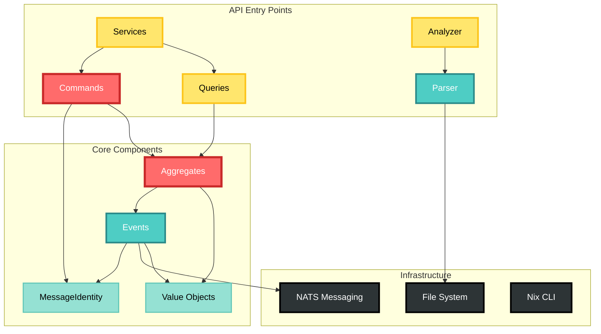
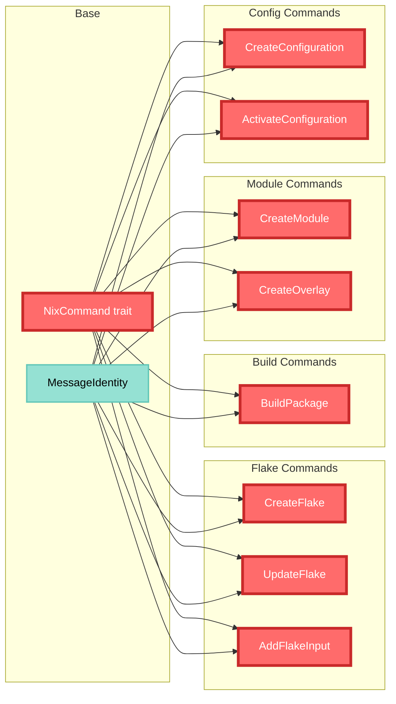
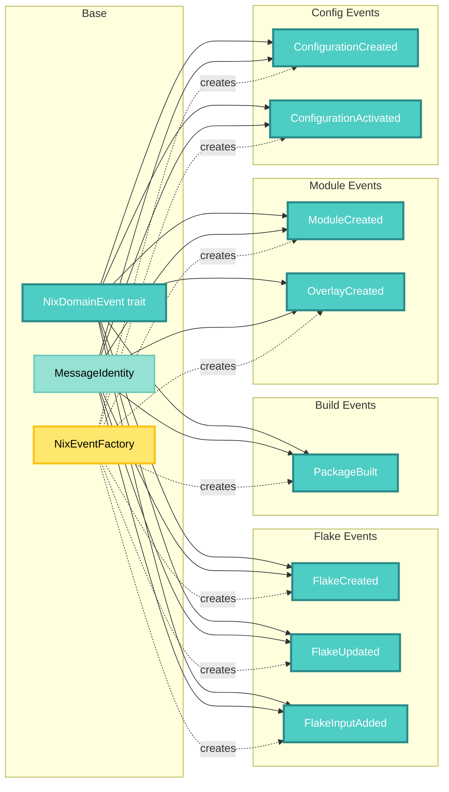
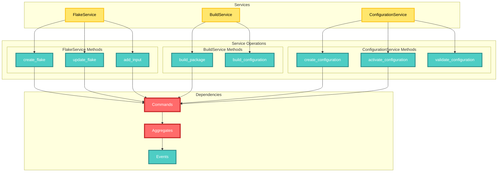
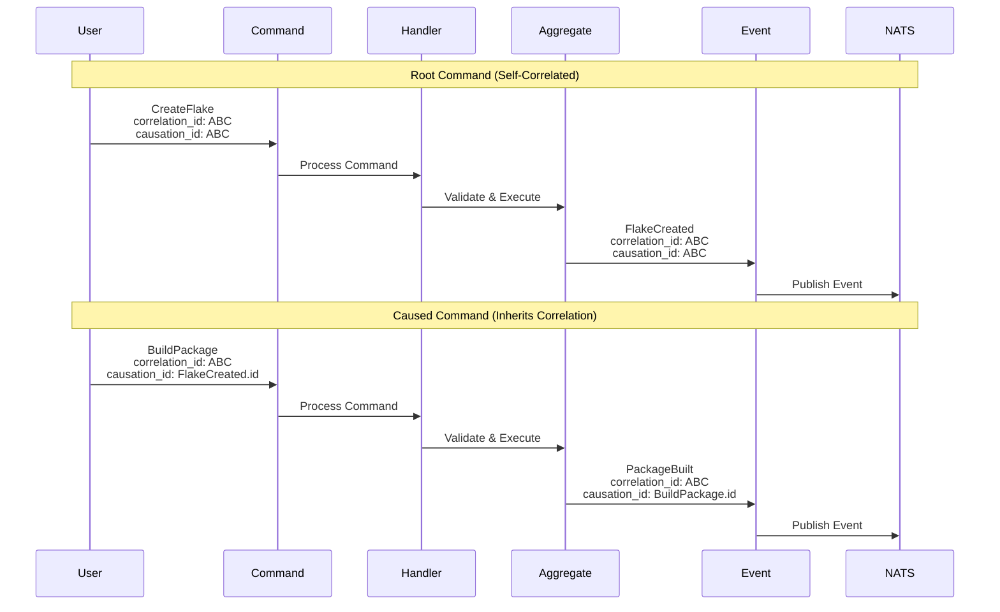
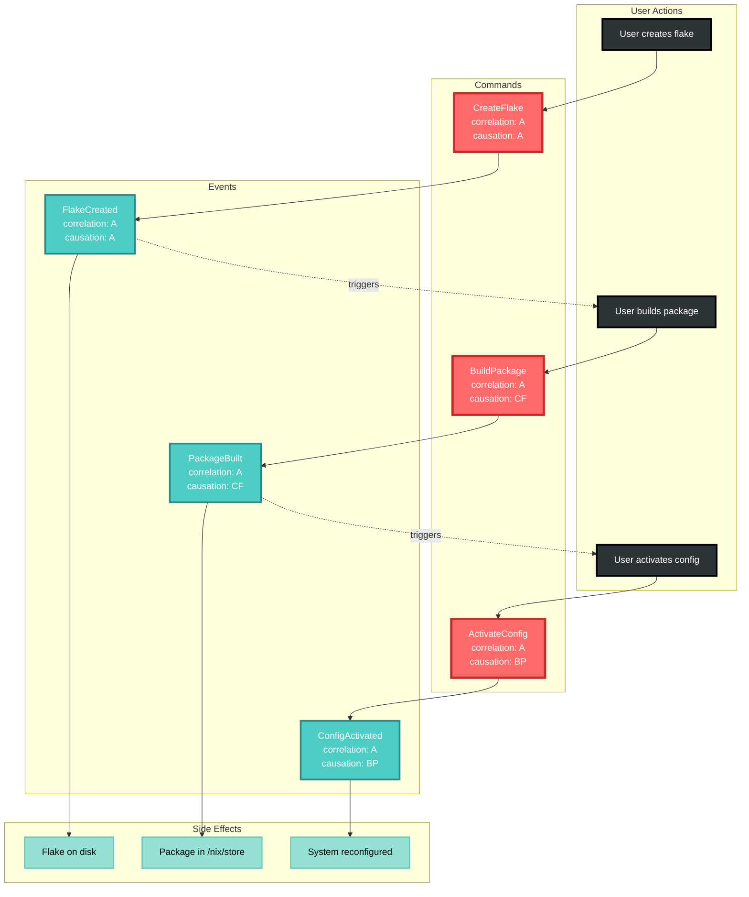
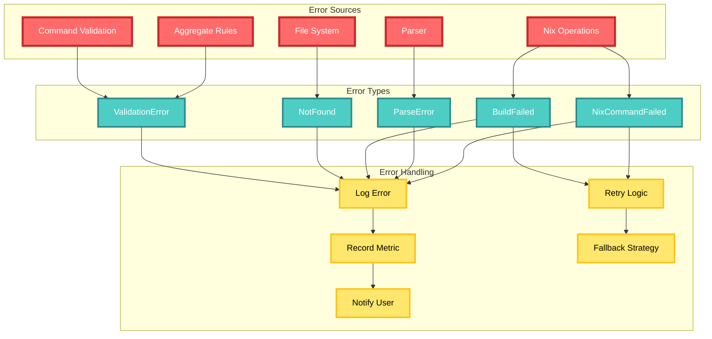
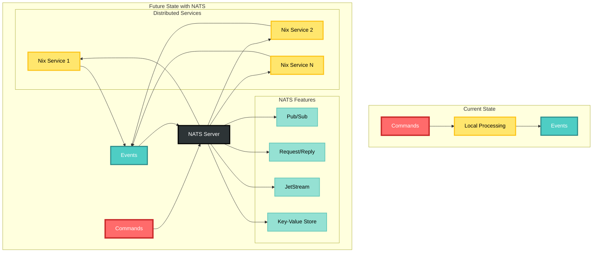

# Nix Domain API Diagrams

## Complete API Overview

## Command Hierarchy

## Event Hierarchy

## Value Objects

```mermaid
graph TB
    subgraph "Message Identity"
        MI[MessageIdentity]
        MID[MessageId]
        CID[CorrelationId]
        CAID[CausationId]
        MF[MessageFactory]
    end
    
    subgraph "Flake Types"
        FR[FlakeRef]
        FI[FlakeInputs]
        FO[FlakeOutputs]
        F[Flake]
    end
    
    subgraph "Path Types"
        AP[AttributePath]
        SP[StorePath]
    end
    
    subgraph "Config Types"
        NM[NixModule]
        OV[Overlay]
        NC[NixOSConfiguration]
        DRV[Derivation]
    end
    
    subgraph "Expression Types"
        NE[NixExpression]
        NV[NixValue]
    end
    
    MI --> MID
    MI --> CID
    MI --> CAID
    MF -.creates.-> MI
    
    F --> FI
    F --> FO
    F --> FR
    
    NC --> NM
    NC --> OV
    
    %% CIM Standard Styling
    %% Message Identity - Results (Light Green)
    style MI fill:#95E1D3,stroke:#63C7B8,stroke-width:2px,color:#000
    style MID fill:#95E1D3,stroke:#63C7B8,stroke-width:2px,color:#000
    style CID fill:#95E1D3,stroke:#63C7B8,stroke-width:2px,color:#000
    style CAID fill:#95E1D3,stroke:#63C7B8,stroke-width:2px,color:#000
    style MF fill:#FFE66D,stroke:#FCC419,stroke-width:3px,color:#000
    
    %% Flake Types - Results (Light Green)
    style FR fill:#95E1D3,stroke:#63C7B8,stroke-width:2px,color:#000
    style FI fill:#95E1D3,stroke:#63C7B8,stroke-width:2px,color:#000
    style FO fill:#95E1D3,stroke:#63C7B8,stroke-width:2px,color:#000
    style F fill:#95E1D3,stroke:#63C7B8,stroke-width:2px,color:#000
    
    %% Path Types - Results (Light Green)
    style AP fill:#95E1D3,stroke:#63C7B8,stroke-width:2px,color:#000
    style SP fill:#95E1D3,stroke:#63C7B8,stroke-width:2px,color:#000
    
    %% Config Types - Results (Light Green)
    style NM fill:#95E1D3,stroke:#63C7B8,stroke-width:2px,color:#000
    style OV fill:#95E1D3,stroke:#63C7B8,stroke-width:2px,color:#000
    style NC fill:#95E1D3,stroke:#63C7B8,stroke-width:2px,color:#000
    style DRV fill:#95E1D3,stroke:#63C7B8,stroke-width:2px,color:#000
    
    %% Expression Types - Results (Light Green)
    style NE fill:#95E1D3,stroke:#63C7B8,stroke-width:2px,color:#000
    style NV fill:#95E1D3,stroke:#63C7B8,stroke-width:2px,color:#000
```

## Service Layer

## Parser and Analyzer API

```mermaid
graph TB
    subgraph "Parser API"
        PF[parse_nix_file]
        PE[parse_nix_expr]
        AM[AstManipulator]
        subgraph "AST Operations"
            AA[add_attribute]
            MV[modify_value]
            RA[remove_attribute]
            TS[to_string]
        end
    end
    
    subgraph "Analyzer API"
        SA[SecurityAnalyzer]
        PA[PerformanceAnalyzer]
        DA[DeadCodeAnalyzer]
        DEP[DependencyAnalyzer]
        
        subgraph "Analysis Results"
            SI[SecurityIssue]
            PS[PerformanceSuggestion]
            DC[DeadCode]
            DG[DependencyGraph]
        end
    end
    
    subgraph "Infrastructure"
        RNIX[rnix Parser]
        AST[Syntax Tree]
        FS[File System]
    end
    
    PF --> RNIX
    PE --> RNIX
    RNIX --> AST
    AST --> AM
    
    AM --> AA
    AM --> MV
    AM --> RA
    AM --> TS
    
    SA --> AST
    PA --> AST
    DA --> AST
    DEP --> AST
    
    SA --> SI
    PA --> PS
    DA --> DC
    DEP --> DG
    
    PF --> FS
    
    %% CIM Standard Styling
    %% Parser - Secondary (Teal)
    style PF fill:#4ECDC4,stroke:#2B8A89,stroke-width:3px,color:#FFF
    style PE fill:#4ECDC4,stroke:#2B8A89,stroke-width:3px,color:#FFF
    style AM fill:#4ECDC4,stroke:#2B8A89,stroke-width:3px,color:#FFF
    
    %% AST Operations - Secondary (Teal)
    style AA fill:#4ECDC4,stroke:#2B8A89,stroke-width:3px,color:#FFF
    style MV fill:#4ECDC4,stroke:#2B8A89,stroke-width:3px,color:#FFF
    style RA fill:#4ECDC4,stroke:#2B8A89,stroke-width:3px,color:#FFF
    style TS fill:#4ECDC4,stroke:#2B8A89,stroke-width:3px,color:#FFF
    
    %% Analyzers - Choice/Query (Yellow)
    style SA fill:#FFE66D,stroke:#FCC419,stroke-width:3px,color:#000
    style PA fill:#FFE66D,stroke:#FCC419,stroke-width:3px,color:#000
    style DA fill:#FFE66D,stroke:#FCC419,stroke-width:3px,color:#000
    style DEP fill:#FFE66D,stroke:#FCC419,stroke-width:3px,color:#000
    
    %% Results - Results (Light Green)
    style SI fill:#95E1D3,stroke:#63C7B8,stroke-width:2px,color:#000
    style PS fill:#95E1D3,stroke:#63C7B8,stroke-width:2px,color:#000
    style DC fill:#95E1D3,stroke:#63C7B8,stroke-width:2px,color:#000
    style DG fill:#95E1D3,stroke:#63C7B8,stroke-width:2px,color:#000
    
    %% Infrastructure - Dark Gray
    style RNIX fill:#2D3436,stroke:#000,stroke-width:3px,color:#FFF
    style AST fill:#2D3436,stroke:#000,stroke-width:3px,color:#FFF
    style FS fill:#2D3436,stroke:#000,stroke-width:3px,color:#FFF
```

## Message Flow with Correlation/Causation

## Complete Workflow Example

## Error Handling Flow

## Future NATS Integration

