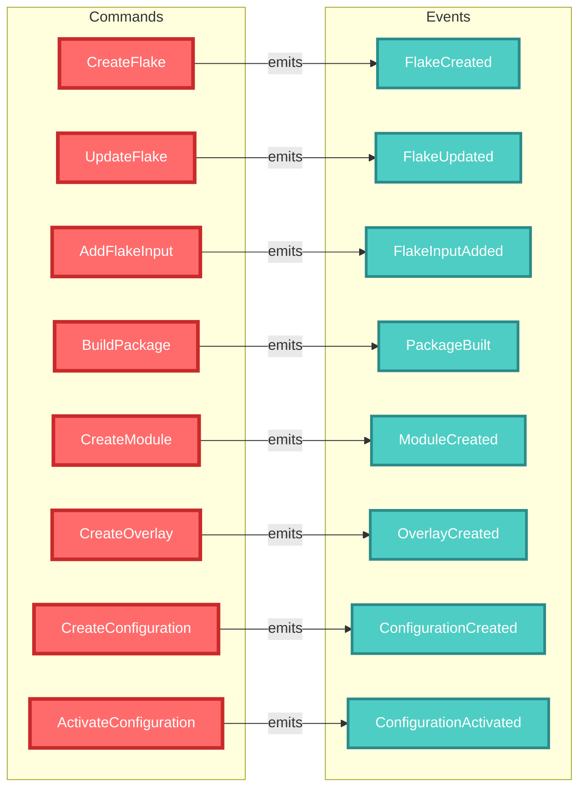

# Nix Domain API Quick Reference

## Command/Event Flow

## Message Identity Pattern

All commands and events MUST include MessageIdentity:

| Pattern | Description | Example |
|---------|-------------|---------|
| Root Message | `message_id = correlation_id = causation_id` | Initial user action |
| Caused Message | Inherits `correlation_id`, `causation_id = parent.message_id` | Subsequent actions |

## Command Quick Reference

| Command | Purpose | Key Fields |
|---------|---------|------------|
| `CreateFlake` | Initialize new flake | `path`, `description`, `template` |
| `UpdateFlake` | Update flake.lock | `path` |
| `AddFlakeInput` | Add flake dependency | `path`, `name`, `url` |
| `BuildPackage` | Build Nix package | `flake_ref`, `attribute` |
| `CreateModule` | Create NixOS module | `name`, `module` |
| `CreateOverlay` | Create package overlay | `name`, `overlay` |
| `CreateConfiguration` | Create NixOS config | `name`, `configuration` |
| `ActivateConfiguration` | Apply NixOS config | `name`, `activation_type` |

## Event Quick Reference

| Event | Triggered By | Key Data |
|-------|--------------|----------|
| `FlakeCreated` | `CreateFlake` | `flake_id`, `path`, `description` |
| `FlakeUpdated` | `UpdateFlake` | `flake_id`, `path` |
| `FlakeInputAdded` | `AddFlakeInput` | `flake_id`, `input_name`, `input_url` |
| `PackageBuilt` | `BuildPackage` | `package_id`, `output_path`, `build_time` |
| `ModuleCreated` | `CreateModule` | `module` details |
| `OverlayCreated` | `CreateOverlay` | `overlay` details |
| `ConfigurationCreated` | `CreateConfiguration` | `configuration` details |
| `ConfigurationActivated` | `ActivateConfiguration` | `configuration_id`, `generation` |

## Value Objects

| Type | Purpose | Example |
|------|---------|---------|
| `FlakeRef` | Reference to flake | `github:NixOS/nixpkgs/nixos-23.11#lib` |
| `AttributePath` | Nix attribute path | `packages.x86_64-linux.hello` |
| `StorePath` | Nix store path | `/nix/store/abc123-hello-1.0` |
| `MessageIdentity` | Correlation/causation | Contains message, correlation, and causation IDs |

## Service Layer

| Service | Responsibility | Main Methods |
|---------|----------------|--------------|
| `FlakeService` | Flake operations | `create_flake()`, `update_flake()`, `add_input()` |
| `BuildService` | Package building | `build_package()` |
| `ConfigurationService` | NixOS configs | `create_configuration()`, `activate_configuration()` |

## Error Types

| Error | When | Recovery |
|-------|------|----------|
| `FlakeNotFound` | Invalid flake path | Check path exists |
| `InvalidFlakeRef` | Bad flake reference | Validate format |
| `BuildFailed` | Nix build error | Check logs |
| `ParseError` | Invalid Nix syntax | Fix expression |
| `NixCommandFailed` | Nix CLI error | Check Nix installation |