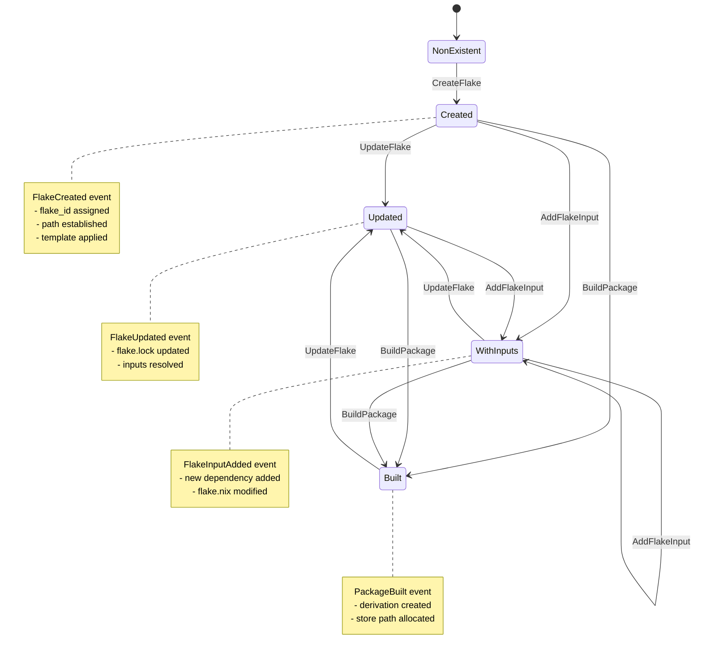
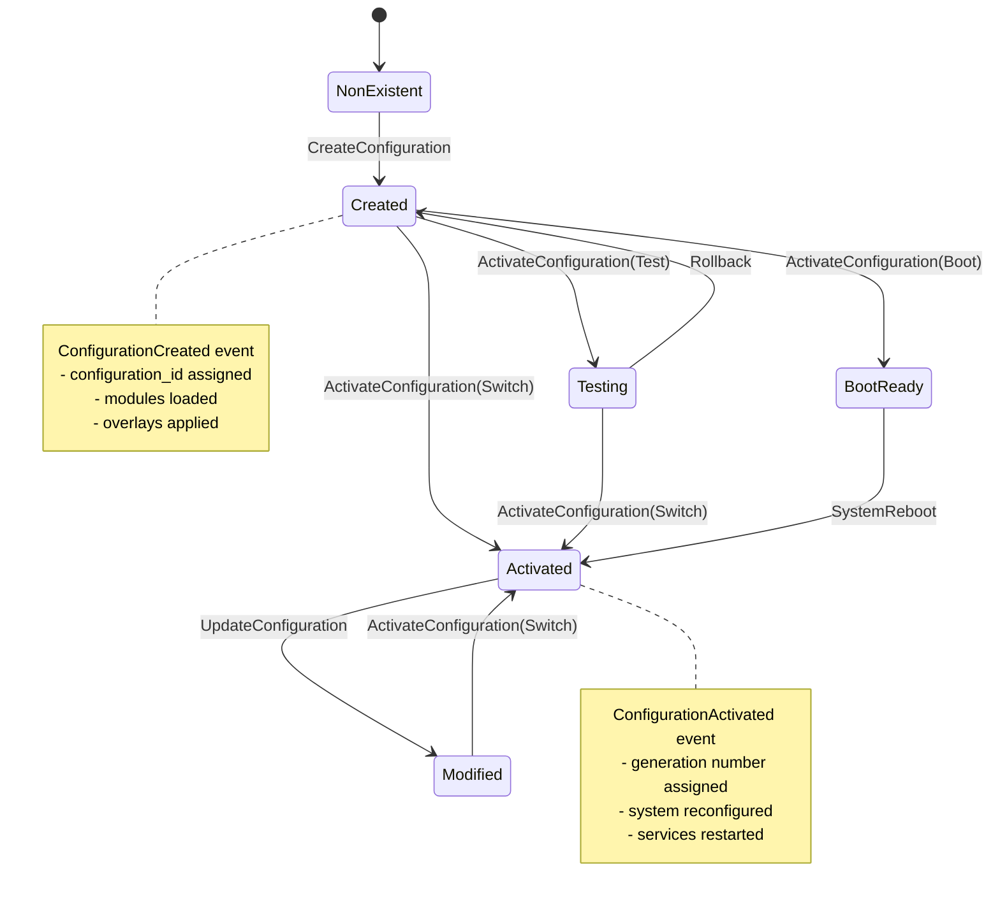
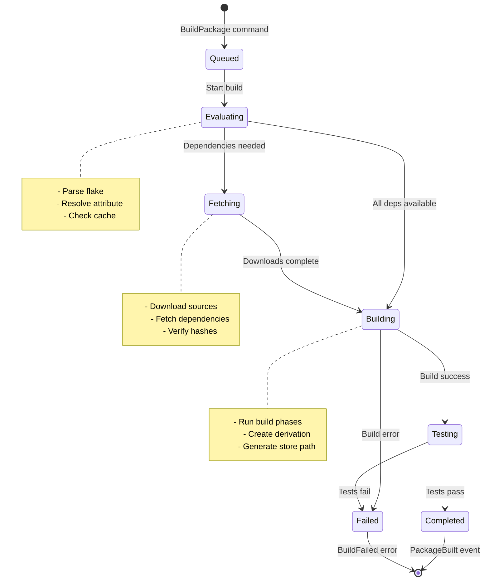
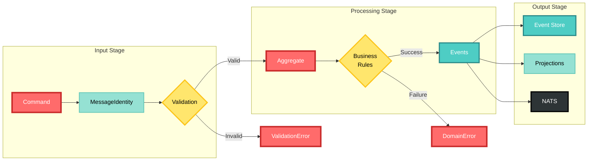
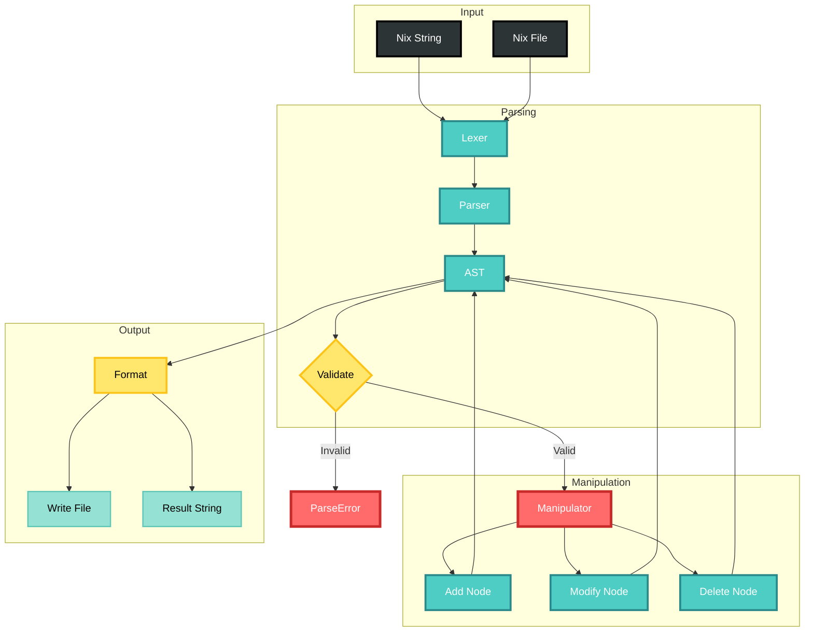
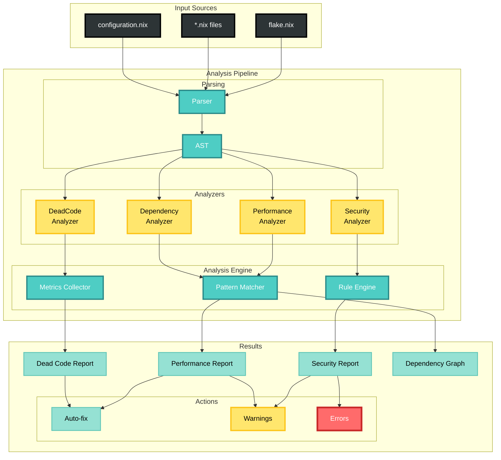
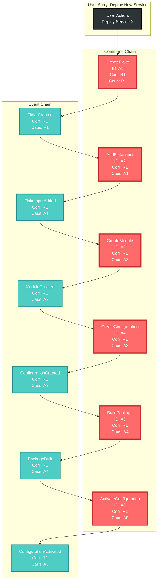
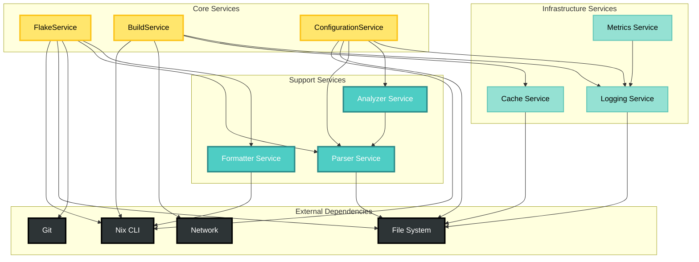

# Nix Domain API State Diagrams

## Flake Lifecycle

## Configuration Lifecycle

## Build Process State Machine

## Command Processing Pipeline

## Parser State Flow

## Analyzer Workflow

## Correlation Chain Example

## Service Dependencies

