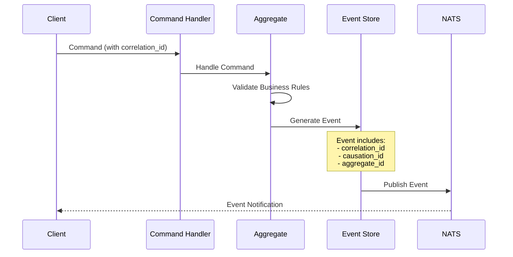
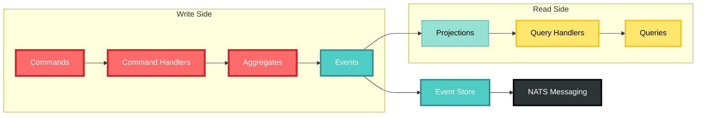
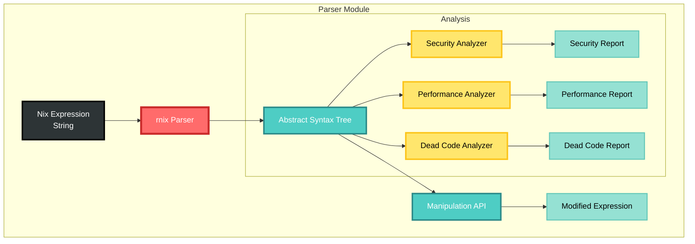
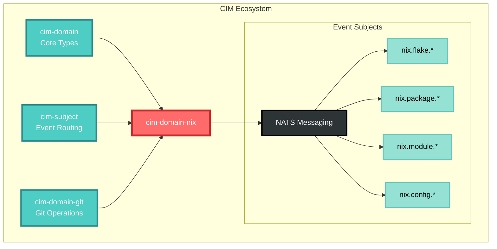

# Nix Domain Architecture Overview

## Domain Structure

```mermaid
graph TB
    subgraph "Nix Domain"
        subgraph "Value Objects"
            FR[FlakeRef]
            AP[AttributePath]
            SP[StorePath]
            DV[Derivation]
            NM[NixModule]
            OV[Overlay]
            NC[NixOSConfiguration]
        end

        subgraph "Aggregates"
            FA[FlakeAggregate]
            MA[ModuleAggregate]
            OA[OverlayAggregate]
            CA[ConfigurationAggregate]
        end

        subgraph "Events"
            FC[FlakeCreated]
            FU[FlakeUpdated]
            FI[FlakeInputAdded]
            PB[PackageBuilt]
            MC[ModuleCreated]
            OC[OverlayCreated]
            CC[ConfigurationCreated]
            CAC[ConfigurationActivated]
        end

        subgraph "Commands"
            CFC[CreateFlake]
            UFC[UpdateFlake]
            AIC[AddInput]
            BPC[BuildPackage]
            CMC[CreateModule]
            COC[CreateOverlay]
            CCC[CreateConfiguration]
            ACC[ActivateConfiguration]
        end

        subgraph "Services"
            FS[FlakeService]
            BS[BuildService]
            CS[ConfigurationService]
        end

        subgraph "Infrastructure"
            NP[Nix Parser<br/>rnix]
            NF[Nix Formatters<br/>nixpkgs-fmt, alejandra]
            NA[Nix Analyzers<br/>Security, Performance]
            GI[Git Integration<br/>flake.lock tracking]
        end
    end

    %% Value Object relationships
    FA --> FR
    FA --> AP
    MA --> NM
    OA --> OV
    CA --> NC
    
    %% Command to Aggregate flow
    CFC --> FA
    UFC --> FA
    AIC --> FA
    BPC --> FA
    CMC --> MA
    COC --> OA
    CCC --> CA
    ACC --> CA
    
    %% Aggregate to Event flow
    FA --> FC
    FA --> FU
    FA --> FI
    FA --> PB
    MA --> MC
    OA --> OC
    CA --> CC
    CA --> CAC
    
    %% Services orchestration
    FS --> FA
    BS --> FA
    CS --> CA
    
    %% Infrastructure support
    FS --> NP
    FS --> NF
    BS --> NA
    CS --> GI

    %% CIM Standard High-Contrast Styling
    %% Value Objects - Results/Outcomes (Light Green)
    style FR fill:#95E1D3,stroke:#63C7B8,stroke-width:2px,color:#000
    style AP fill:#95E1D3,stroke:#63C7B8,stroke-width:2px,color:#000
    style SP fill:#95E1D3,stroke:#63C7B8,stroke-width:2px,color:#000
    style DV fill:#95E1D3,stroke:#63C7B8,stroke-width:2px,color:#000
    style NM fill:#95E1D3,stroke:#63C7B8,stroke-width:2px,color:#000
    style OV fill:#95E1D3,stroke:#63C7B8,stroke-width:2px,color:#000
    style NC fill:#95E1D3,stroke:#63C7B8,stroke-width:2px,color:#000
    
    %% Aggregates - Primary/Core (Red)
    style FA fill:#FF6B6B,stroke:#C92A2A,stroke-width:4px,color:#FFF
    style MA fill:#FF6B6B,stroke:#C92A2A,stroke-width:4px,color:#FFF
    style OA fill:#FF6B6B,stroke:#C92A2A,stroke-width:4px,color:#FFF
    style CA fill:#FF6B6B,stroke:#C92A2A,stroke-width:4px,color:#FFF
    
    %% Events - Secondary/Storage (Teal)
    style FC fill:#4ECDC4,stroke:#2B8A89,stroke-width:3px,color:#FFF
    style FU fill:#4ECDC4,stroke:#2B8A89,stroke-width:3px,color:#FFF
    style FI fill:#4ECDC4,stroke:#2B8A89,stroke-width:3px,color:#FFF
    style PB fill:#4ECDC4,stroke:#2B8A89,stroke-width:3px,color:#FFF
    style MC fill:#4ECDC4,stroke:#2B8A89,stroke-width:3px,color:#FFF
    style OC fill:#4ECDC4,stroke:#2B8A89,stroke-width:3px,color:#FFF
    style CC fill:#4ECDC4,stroke:#2B8A89,stroke-width:3px,color:#FFF
    style CAC fill:#4ECDC4,stroke:#2B8A89,stroke-width:3px,color:#FFF
    
    %% Commands - Primary/Core (Red)
    style CFC fill:#FF6B6B,stroke:#C92A2A,stroke-width:4px,color:#FFF
    style UFC fill:#FF6B6B,stroke:#C92A2A,stroke-width:4px,color:#FFF
    style AIC fill:#FF6B6B,stroke:#C92A2A,stroke-width:4px,color:#FFF
    style BPC fill:#FF6B6B,stroke:#C92A2A,stroke-width:4px,color:#FFF
    style CMC fill:#FF6B6B,stroke:#C92A2A,stroke-width:4px,color:#FFF
    style COC fill:#FF6B6B,stroke:#C92A2A,stroke-width:4px,color:#FFF
    style CCC fill:#FF6B6B,stroke:#C92A2A,stroke-width:4px,color:#FFF
    style ACC fill:#FF6B6B,stroke:#C92A2A,stroke-width:4px,color:#FFF
    
    %% Services - Choice/Query (Yellow)
    style FS fill:#FFE66D,stroke:#FCC419,stroke-width:3px,color:#000
    style BS fill:#FFE66D,stroke:#FCC419,stroke-width:3px,color:#000
    style CS fill:#FFE66D,stroke:#FCC419,stroke-width:3px,color:#000
    
    %% Infrastructure - Start/Root (Dark Gray)
    style NP fill:#2D3436,stroke:#000,stroke-width:3px,color:#FFF
    style NF fill:#2D3436,stroke:#000,stroke-width:3px,color:#FFF
    style NA fill:#2D3436,stroke:#000,stroke-width:3px,color:#FFF
    style GI fill:#2D3436,stroke:#000,stroke-width:3px,color:#FFF
```

## Event Flow

## CQRS Pattern

## Parser Architecture

## Integration with CIM Ecosystem

## Key Design Principles

1. **Event-Driven**: All state changes are events with correlation/causation IDs
2. **CQRS**: Separate command and query models
3. **Domain Isolation**: No shared state with other domains
4. **Parser Integration**: Full AST manipulation capabilities
5. **CIM Standards**: Follows all CIM patterns and conventions