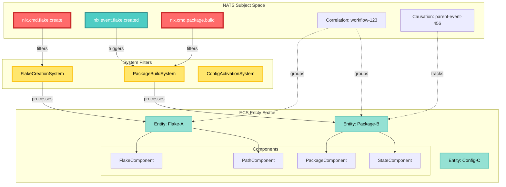
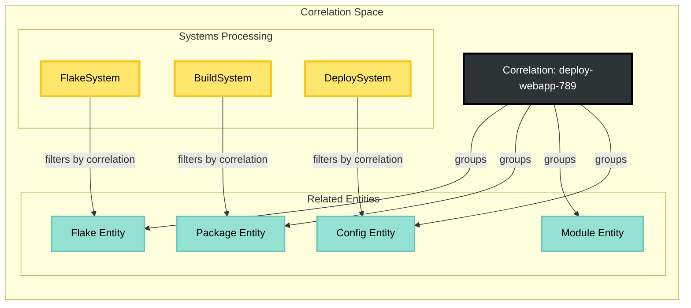
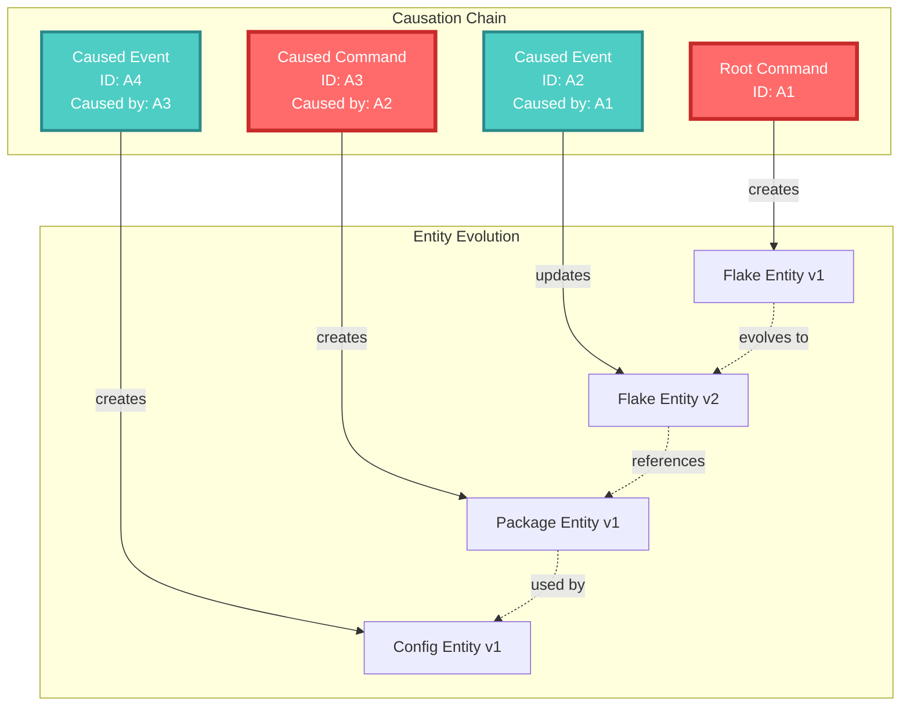
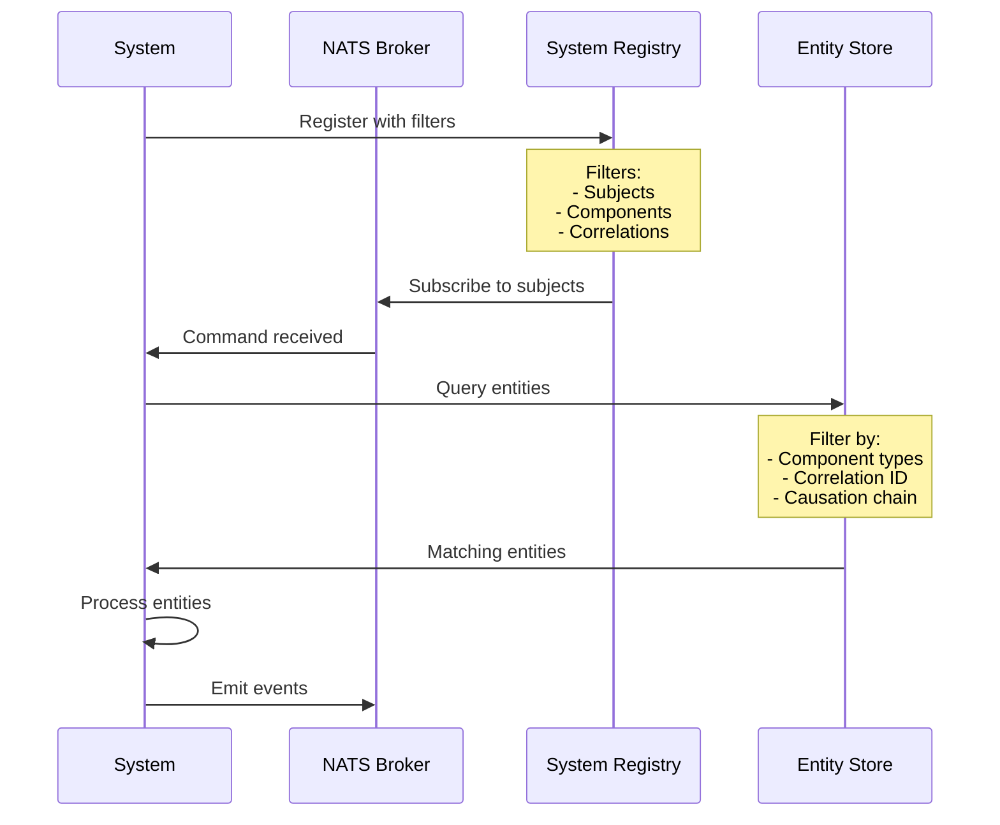
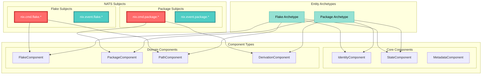
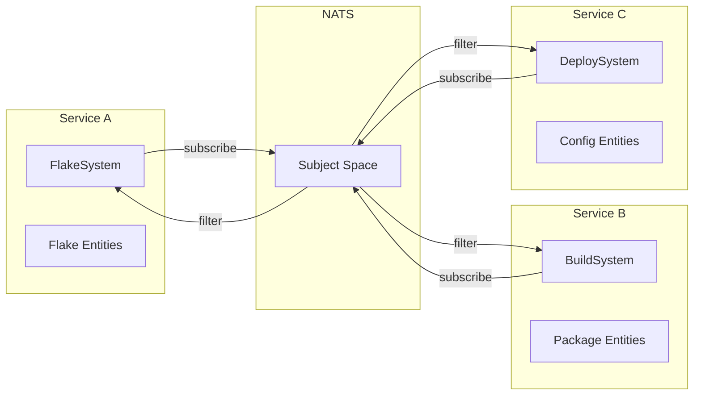

# NATS Subject Algebra to ECS Mapping

## Overview

The CIM architecture maps NATS subject algebras to Entity Component System (ECS) patterns, where subject subscriptions act as system filters that determine which entities and components are processed. This creates a distributed ECS where systems can run across multiple services based on subject/correlation/causation filtering.

## Core Concepts

### Subject Algebra as System Filters

In traditional ECS:
```
System = Query<Components> → Transform<Entities>
```

In CIM's distributed ECS:
```
System = Subscribe<Subject × Correlation × Causation> → Transform<Entities>
```

Where:
- **Subject** defines the component types and operations
- **Correlation** groups related entity transformations
- **Causation** tracks entity transformation lineage

## Mapping Architecture



## Subject Algebra as Component Queries

### Traditional ECS Query
```rust
// Local ECS query
fn build_system(
    query: Query<(&FlakeComponent, &mut StateComponent), With<PackageComponent>>
) {
    for (flake, mut state) in query.iter_mut() {
        // Process entities with all required components
    }
}
```

### CIM Distributed Query
```rust
// Distributed ECS via NATS subjects
impl System for PackageBuildSystem {
    fn subscription_filter() -> SubjectFilter {
        SubjectFilter::new()
            .subjects(vec![
                "nix.cmd.package.build",
                "nix.event.flake.updated"
            ])
            .with_component_types(vec![
                ComponentType::Flake,
                ComponentType::Package,
                ComponentType::State
            ])
    }
    
    async fn process(&self, entity: Entity, components: Components) {
        // Process entities matching subject filter
    }
}
```

## Correlation as Entity Grouping



## Causation as Entity Lineage



## System Registration Pattern



## Component Type Mapping



## Implementation Example

### System Definition
```rust
use cim_domain_nix::ecs::{System, SubjectFilter, ComponentQuery};

pub struct FlakeUpdateSystem {
    subject_filter: SubjectFilter,
    component_query: ComponentQuery,
}

impl FlakeUpdateSystem {
    pub fn new() -> Self {
        Self {
            subject_filter: SubjectFilter::new()
                .subjects(vec![
                    "nix.cmd.flake.update",
                    "nix.event.flake.input_added"
                ])
                .correlation_required(true),
            component_query: ComponentQuery::new()
                .required(vec![
                    ComponentType::Flake,
                    ComponentType::Path,
                    ComponentType::State
                ])
                .optional(vec![
                    ComponentType::GitRepo
                ]),
        }
    }
}

#[async_trait]
impl System for FlakeUpdateSystem {
    async fn process(
        &self,
        entity_id: EntityId,
        components: ComponentBundle,
        context: SystemContext,
    ) -> Result<Vec<Event>> {
        // Extract components
        let flake: &FlakeComponent = components.get()?;
        let path: &PathComponent = components.get()?;
        let mut state: &mut StateComponent = components.get_mut()?;
        
        // Process based on correlation context
        if let Some(correlation) = context.correlation_id {
            // Part of a larger workflow
            state.workflow_id = Some(correlation);
        }
        
        // Update flake
        let events = self.update_flake(flake, path).await?;
        
        // Track causation
        Ok(events.into_iter()
            .map(|e| e.with_causation(context.message_id))
            .collect())
    }
}
```

### Entity Component Composition
```rust
// Define component types
#[derive(Component)]
pub struct FlakeComponent {
    pub flake_id: FlakeId,
    pub description: String,
    pub inputs: HashMap<String, FlakeRef>,
}

#[derive(Component)]
pub struct StateComponent {
    pub status: EntityStatus,
    pub last_modified: DateTime<Utc>,
    pub workflow_id: Option<CorrelationId>,
    pub version: u64,
}

// Entity archetypes
pub fn create_flake_entity(
    world: &mut World,
    flake_id: FlakeId,
    path: PathBuf,
    correlation: CorrelationId,
) -> Entity {
    world.spawn()
        .insert(IdentityComponent::new(flake_id))
        .insert(FlakeComponent::new(flake_id))
        .insert(PathComponent::new(path))
        .insert(StateComponent::new())
        .insert(CorrelationComponent::new(correlation))
        .id()
}
```

### Subscription-Based System Execution
```rust
pub struct SystemScheduler {
    systems: HashMap<SubjectPattern, Box<dyn System>>,
    entity_store: EntityStore,
}

impl SystemScheduler {
    pub async fn handle_message(
        &mut self,
        subject: &str,
        headers: HeaderMap,
        payload: Bytes,
    ) -> Result<()> {
        // Extract correlation/causation from headers
        let correlation_id = headers.get("X-Correlation-ID")
            .and_then(|v| v.parse().ok());
        let causation_id = headers.get("X-Causation-ID")
            .and_then(|v| v.parse().ok());
        
        // Find matching systems
        for (pattern, system) in &self.systems {
            if pattern.matches(subject) {
                // Query entities matching system requirements
                let entities = self.entity_store
                    .query()
                    .with_components(&system.required_components())
                    .with_correlation(correlation_id)
                    .execute()
                    .await?;
                
                // Process each entity
                for entity in entities {
                    let context = SystemContext {
                        subject: subject.to_string(),
                        correlation_id,
                        causation_id,
                        message_id: Uuid::new_v4(),
                    };
                    
                    let events = system.process(
                        entity.id,
                        entity.components,
                        context,
                    ).await?;
                    
                    // Publish resulting events
                    for event in events {
                        self.publish_event(event).await?;
                    }
                }
            }
        }
        
        Ok(())
    }
}
```

## Benefits of Subject-Based ECS

### 1. Distributed System Execution
Systems can run across multiple services while operating on the same logical entities:



### 2. Dynamic System Composition
Systems can be added/removed at runtime by subscribing/unsubscribing to subjects:

```rust
// Add a new system dynamically
scheduler.register_system(
    "nix.event.flake.created",
    Box::new(FlakeAnalysisSystem::new())
).await?;

// Remove a system
scheduler.unregister_system("nix.cmd.flake.delete").await?;
```

### 3. Correlation-Based Workflows
Complex workflows are naturally expressed through correlation filtering:

```mermaid
graph TD
    subgraph "Workflow: Deploy Application"
        W1[Create Flake]
        W2[Build Packages]
        W3[Create Config]
        W4[Activate Config]
    end
    
    subgraph "Systems"
        S1[FlakeSystem]
        S2[BuildSystem]
        S3[ConfigSystem]
        S4[ActivationSystem]
    end
    
    W1 -->|correlation: X| S1
    W2 -->|correlation: X| S2
    W3 -->|correlation: X| S3
    W4 -->|correlation: X| S4
    
    Note over S1,S4: All systems filter by correlation X
```

### 4. Causation-Based Debugging
Entity state evolution can be traced through causation chains:

```rust
// Trace entity history
async fn trace_entity_lineage(
    entity_id: EntityId,
    store: &EntityStore,
) -> Vec<EntityVersion> {
    let mut history = Vec::new();
    let mut current = store.get_entity(entity_id).await?;
    
    while let Some(causation) = current.causation_id {
        history.push(current.clone());
        current = store.get_entity_by_event(causation).await?;
    }
    
    history.reverse();
    history
}
```

## Advanced Patterns

### Subject Algebra Joins
Combine multiple subject patterns for complex system filters:

```rust
let filter = SubjectFilter::new()
    .union(vec![
        "nix.cmd.flake.*",
        "nix.event.package.built"
    ])
    .intersect_correlation(vec![
        "workflow-*",
        "deploy-*"
    ]);
```

### Component Algebra
Define component requirements using set operations:

```rust
let query = ComponentQuery::new()
    .all_of(vec![FlakeComponent, StateComponent])
    .any_of(vec![GitComponent, PathComponent])
    .none_of(vec![ErrorComponent]);
```

### Temporal Filtering
Filter entities based on temporal relationships:

```rust
let filter = TemporalFilter::new()
    .within_correlation_window(Duration::hours(1))
    .causation_depth(3)
    .after(timestamp);
```

## Conclusion

By mapping NATS subject algebras to ECS patterns, CIM creates a powerful distributed system architecture where:

1. **Subjects** act as system execution filters
2. **Correlation** groups related entity transformations
3. **Causation** tracks entity evolution lineage
4. **Systems** process entities based on subscription filters
5. **Components** are queried across distributed services

This approach enables building complex, distributed applications while maintaining the simplicity and performance benefits of ECS architecture.