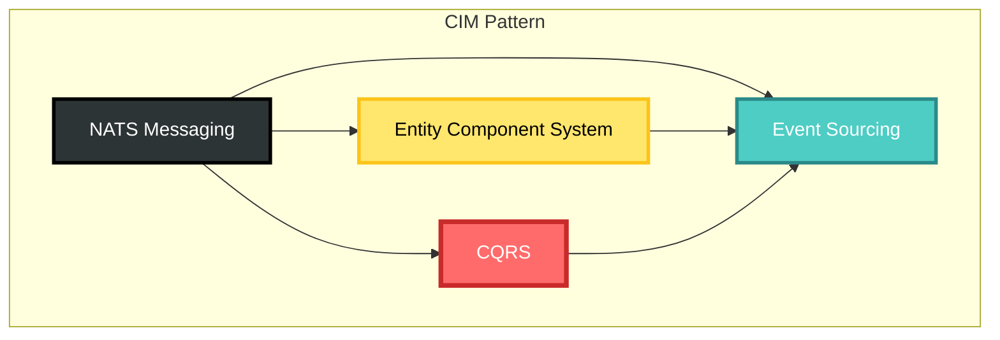

# NATS Integration Documentation Index

## Overview

The Nix domain provides comprehensive NATS integration enabling distributed command processing, event streaming, and Entity Component System (ECS) patterns through subject algebras.

## Documentation Structure

### 📚 Core Documentation

1. **[NATS Integration](./nats-integration.md)** - Main integration guide
   - Architecture overview
   - Component descriptions
   - Configuration
   - Usage examples
   - Performance and security considerations

2. **[NATS Subject Mapping](./nats-subject-mapping.md)** - Complete subject reference
   - All 46 subjects listed
   - Command subjects (16)
   - Event subjects (16) 
   - Query subjects (14)
   - Implementation examples

3. **[NATS Subject Algebra](./nats-subject-algebra.md)** - Visual subject representations
   - Subject hierarchy diagrams
   - Command, Event, and Query trees
   - Wildcard patterns
   - Set theory representation
   - Validation rules
   - Security models

4. **[NATS-ECS Mapping](./nats-ecs-mapping.md)** - Distributed Entity Component System
   - Subject algebras as system filters
   - Correlation as entity grouping
   - Causation as entity lineage
   - Implementation patterns
   - Advanced filtering techniques

### 🔑 Key Concepts

#### Subject Structure
```
{domain}.{message_type}.{aggregate}.{action}
```
- `domain`: Always "nix" for this domain
- `message_type`: cmd | event | query
- `aggregate`: flake | package | module | overlay | config
- `action`: Varies by type (create, build, get, etc.)

#### Message Identity
Every message includes:
- **Message ID**: Unique identifier
- **Correlation ID**: Groups related operations
- **Causation ID**: Links cause and effect

#### ECS Mapping
- **Subjects** → System execution filters
- **Correlation** → Entity grouping
- **Causation** → Entity lineage tracking
- **Components** → Distributed across services

### 📊 Quick Statistics

| Category | Count |
|----------|-------|
| Total Subjects | 46 |
| Command Subjects | 16 |
| Event Subjects | 16 |
| Query Subjects | 14 |
| Aggregates | 5 |
| Special Subjects | 3 |

### 🏗️ Architecture Patterns



### 🚀 Getting Started

1. **For Developers**
   - Start with [NATS Integration](./nats-integration.md) for setup
   - Review [Subject Mapping](./nats-subject-mapping.md) for available operations
   - Study [ECS Mapping](./nats-ecs-mapping.md) for system design

2. **For Architects**
   - Review [Subject Algebra](./nats-subject-algebra.md) for system design
   - Understand [ECS Mapping](./nats-ecs-mapping.md) for distributed patterns
   - Check security models in the algebra documentation

3. **For DevOps**
   - Focus on configuration in [NATS Integration](./nats-integration.md)
   - Review health and discovery patterns
   - Understand monitoring through special subjects

### 🔗 Related Documentation

- [Architecture Overview](./architecture/domain-overview.md)
- [API Documentation](./api.md)
- [Completion Roadmap](./plan/completion-roadmap.md)

### 💡 Key Insights

1. **Distributed by Design**: NATS enables true microservice architecture
2. **Type-Safe Messaging**: Subject mapping ensures compile-time safety
3. **ECS at Scale**: Entity Component System patterns work across services
4. **Event Sourced**: Full audit trail through correlation/causation
5. **Observable**: Built-in health checks and service discovery

### 🛠️ Implementation Status

- ✅ Subject mapping (complete)
- ✅ Event publisher (complete)
- ✅ Command subscriber (complete)
- ✅ Health/Discovery services (complete)
- ✅ Documentation (complete)
- ⏳ JetStream integration (future)
- ⏳ Distributed ECS runtime (future)