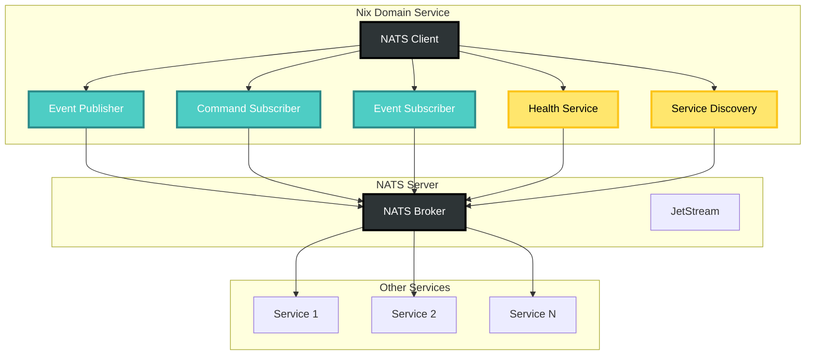

# NATS Integration Documentation

## Overview

The Nix domain provides comprehensive NATS integration for distributed command processing and event streaming. This enables the domain to participate in the CIM distributed architecture.

## Architecture



## Components

### 1. NATS Client (`client.rs`)

Manages the connection to NATS with automatic reconnection and authentication support.

```rust
use cim_domain_nix::nats::{NatsClient, NatsConfig};

// Connect with default configuration
let config = NatsConfig::default();
let client = NatsClient::connect(config).await?;

// Connect with custom configuration
let config = NatsConfig::new("nats://remote:4222")
    .with_auth(NatsAuth {
        username: Some("user".to_string()),
        password: Some("pass".to_string()),
        ..Default::default()
    });
let client = NatsClient::connect(config).await?;
```

### 2. Event Publisher (`publisher.rs`)

Publishes domain events to NATS with proper headers and correlation tracking.

```rust
use cim_domain_nix::nats::EventPublisher;
use cim_domain_nix::events::FlakeCreated;

let publisher = EventPublisher::new(
    client.client().clone(),
    "nix".to_string()
);

// Publish a single event
let event = FlakeCreated { /* ... */ };
publisher.publish_event(&event).await?;

// Publish multiple events
let events = vec![event1, event2, event3];
publisher.publish_events(&events).await?;
```

### 3. Command Subscriber (`subscriber.rs`)

Subscribes to command subjects and processes incoming commands.

```rust
use cim_domain_nix::nats::{CommandSubscriber, CommandHandler};
use std::sync::Arc;

// Implement command handler
struct MyCommandHandler;

#[async_trait::async_trait]
impl CommandHandler for MyCommandHandler {
    async fn handle_command(
        &self,
        command: Box<dyn NixCommand>,
    ) -> Result<Vec<Box<dyn NixDomainEvent>>> {
        // Process command and return events
    }
}

// Create and start subscriber
let handler = Arc::new(MyCommandHandler);
let mut subscriber = CommandSubscriber::new(
    client.client().clone(),
    handler,
    publisher,
);
subscriber.start().await?;
```

### 4. Health Service (`health.rs`)

Responds to health check requests for monitoring and service discovery.

```rust
use cim_domain_nix::nats::HealthService;

let mut health = HealthService::new(
    client.client().clone(),
    "cim-domain-nix".to_string(),
    env!("CARGO_PKG_VERSION").to_string(),
);
health.start().await?;
```

### 5. Service Discovery (`health.rs`)

Announces service capabilities and responds to discovery requests.

```rust
use cim_domain_nix::nats::{ServiceDiscovery, ServiceInfo};

let info = ServiceInfo {
    name: "cim-domain-nix".to_string(),
    version: env!("CARGO_PKG_VERSION").to_string(),
    instance_id: Uuid::new_v4().to_string(),
    description: "Nix domain service".to_string(),
    capabilities: vec!["flake.create", "package.build"],
    endpoints: vec!["nix.cmd.flake.create", "nix.cmd.package.build"],
};

let mut discovery = ServiceDiscovery::new(client.client().clone(), info);
discovery.start().await?;
```

## Subject Mapping

All subjects follow the pattern: `{domain}.{type}.{aggregate}.{action}`

- **Complete Subject List**: See [NATS Subject Mapping](./nats-subject-mapping.md)
- **Visual Subject Algebra**: See [NATS Subject Algebra](./nats-subject-algebra.md) for mermaid diagrams
- **ECS Integration**: See [NATS-ECS Mapping](./nats-ecs-mapping.md) for how subjects map to Entity Component Systems

## Message Headers

All messages include standard headers:

| Header | Description | Example |
|--------|-------------|---------|
| `X-Event-ID` | Unique event identifier | `550e8400-e29b-41d4-a716-446655440000` |
| `X-Event-Type` | Event type name | `FlakeCreated` |
| `X-Correlation-ID` | Correlation identifier | `550e8400-e29b-41d4-a716-446655440001` |
| `X-Causation-ID` | What caused this event | `550e8400-e29b-41d4-a716-446655440002` |
| `X-Aggregate-ID` | Aggregate identifier | `550e8400-e29b-41d4-a716-446655440003` |
| `X-Timestamp` | Event timestamp | `2024-01-01T12:00:00Z` |
| `X-Domain` | Source domain | `nix` |

## Configuration

### Environment Variables

- `NATS_URL`: NATS server URL (default: `nats://localhost:4222`)
- `NATS_USER`: Username for authentication
- `NATS_PASSWORD`: Password for authentication
- `NATS_TOKEN`: Token for authentication

### Configuration File

```toml
[nats]
url = "nats://localhost:4222"
subject_prefix = "nix"

[nats.auth]
username = "nix-service"
password = "secret"

[nats.retry]
max_reconnects = 10
reconnect_delay_ms = 100
max_reconnect_delay_ms = 10000

[nats.service]
name = "cim-domain-nix"
version = "0.3.0"
description = "Nix domain service for CIM"
```

## Usage Examples

### Complete Service Setup

```rust
use cim_domain_nix::nats::*;
use std::sync::Arc;

#[tokio::main]
async fn main() -> Result<(), Box<dyn std::error::Error>> {
    // Load configuration
    let config = NatsConfig::from_env();
    
    // Connect to NATS
    let client = NatsClient::connect(config.clone()).await?;
    
    // Create event publisher
    let publisher = Arc::new(EventPublisher::new(
        client.client().clone(),
        config.subject_prefix.clone(),
    ));
    
    // Start health service
    let mut health = HealthService::new(
        client.client().clone(),
        config.service.name.clone(),
        config.service.version.clone(),
    );
    health.start().await?;
    
    // Start service discovery
    let service_info = ServiceInfo {
        name: config.service.name.clone(),
        version: config.service.version.clone(),
        instance_id: config.service.instance_id.clone(),
        description: config.service.description.clone(),
        capabilities: vec!["flake", "package", "config"],
        endpoints: SubjectMapper::all_command_subjects()
            .into_iter()
            .map(|s| s.to_string())
            .collect(),
    };
    
    let mut discovery = ServiceDiscovery::new(
        client.client().clone(),
        service_info,
    );
    discovery.start().await?;
    
    // Start command subscriber
    let handler = Arc::new(MyCommandHandler::new());
    let mut subscriber = CommandSubscriber::new(
        client.client().clone(),
        handler,
        publisher,
    );
    subscriber.start().await?;
    
    // Keep service running
    tokio::signal::ctrl_c().await?;
    
    Ok(())
}
```

### Publishing Events

```rust
// Create event with correlation
let event = NixEventFactory::create_flake_created(
    flake_id,
    path,
    description,
    template,
    &parent_identity, // For correlation
);

// Publish
publisher.publish_event(&event).await?;
```

### Subscribing to Specific Events

```rust
use cim_domain_nix::nats::{EventSubscriber, EventHandler, EventAction, NixSubject};

struct MyEventHandler;

#[async_trait::async_trait]
impl EventHandler for MyEventHandler {
    async fn handle_event(&self, event: Box<dyn NixDomainEvent>) -> Result<()> {
        // Handle event
    }
}

let handler = Arc::new(MyEventHandler);
let mut subscriber = EventSubscriber::new(client.client().clone(), handler);

// Subscribe to specific events
subscriber.subscribe(vec![
    NixSubject::event(EventAction::FlakeCreated),
    NixSubject::event(EventAction::PackageBuilt),
]).await?;
```

## Testing

### Unit Tests

```rust
#[tokio::test]
async fn test_event_publishing() {
    let client = create_test_client().await;
    let publisher = EventPublisher::new(client, "test".to_string());
    
    let event = create_test_event();
    publisher.publish_event(&event).await.unwrap();
}
```

### Integration Tests

Integration tests require a running NATS server:

```bash
# Start NATS for testing
docker run -d --name nats-test -p 4222:4222 nats:latest

# Run integration tests
cargo test --features integration-tests

# Clean up
docker stop nats-test && docker rm nats-test
```

## Performance Considerations

1. **Batching**: Use `publish_events()` for multiple events
2. **Async Processing**: All operations are async for non-blocking I/O
3. **Connection Pooling**: Single client connection is reused
4. **Header Compression**: Consider enabling compression for large payloads
5. **Subject Filtering**: Use specific subjects rather than wildcards when possible

## Error Handling

All NATS operations return `Result<T, NatsError>`:

```rust
match publisher.publish_event(&event).await {
    Ok(_) => info!("Event published"),
    Err(NatsError::PublishError(e)) => error!("Publish failed: {}", e),
    Err(NatsError::SerializationError(e)) => error!("Serialization failed: {}", e),
    Err(e) => error!("Unexpected error: {}", e),
}
```

## Monitoring

### Health Checks

```bash
# Check service health
nats request health.cim-domain-nix ''

# Response:
{
  "status": "healthy",
  "service": "cim-domain-nix",
  "version": "0.3.0",
  "timestamp": "2024-01-01T12:00:00Z"
}
```

### Service Discovery

```bash
# Discover service
nats request discovery.cim-domain-nix ''

# List all services
nats subscribe discovery.announce
```

## Security

1. **Authentication**: Support for username/password, token, and NKey
2. **TLS**: Full TLS support with client certificates
3. **Authorization**: Subject-based permissions (configured in NATS server)
4. **Message Validation**: All messages are validated before processing

## Future Enhancements

1. **JetStream Integration**: For persistent messaging
2. **Request/Reply**: For synchronous operations
3. **Key-Value Store**: For configuration and state
4. **Metrics Export**: Prometheus metrics for monitoring
5. **Distributed Tracing**: OpenTelemetry integration