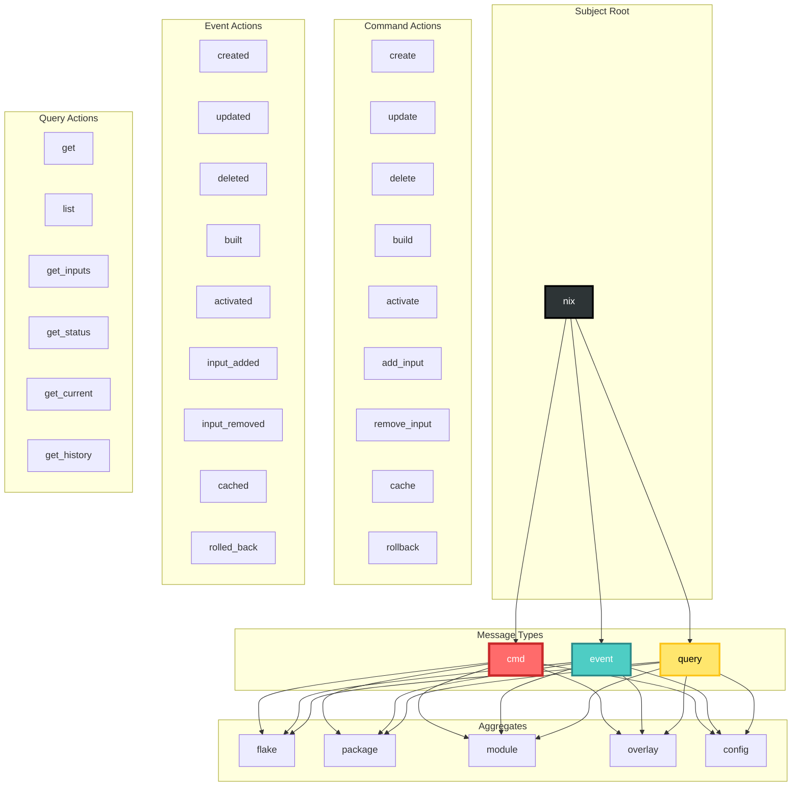
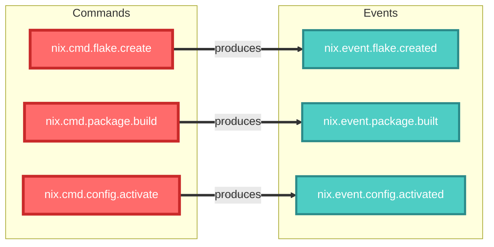
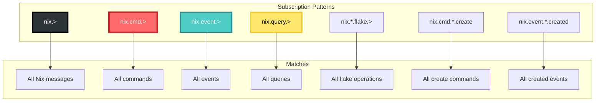
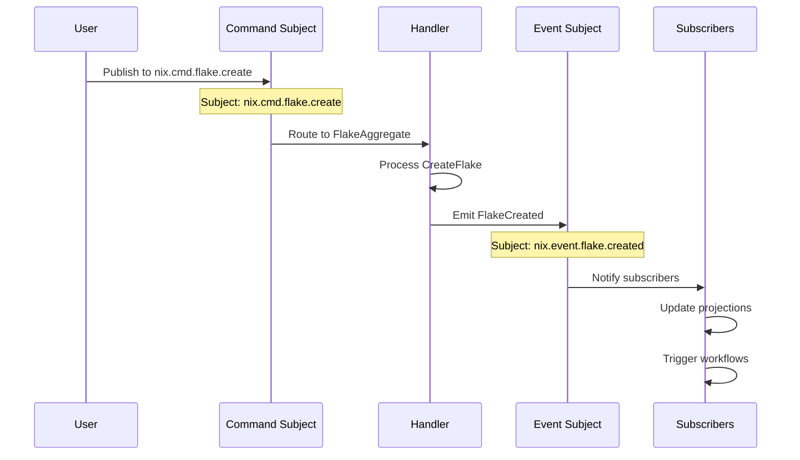
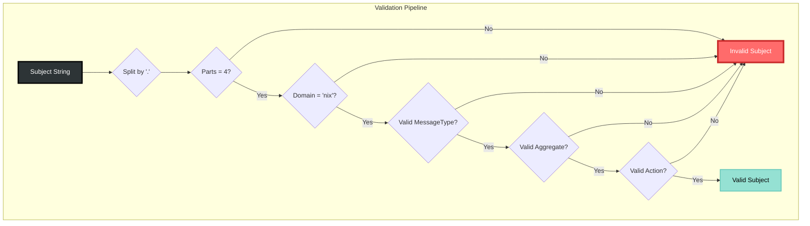
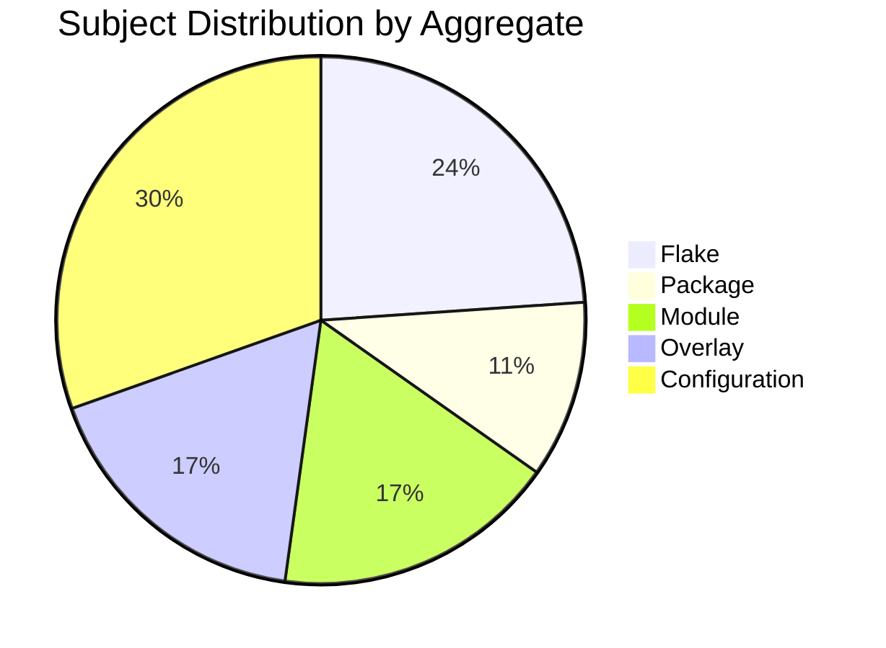
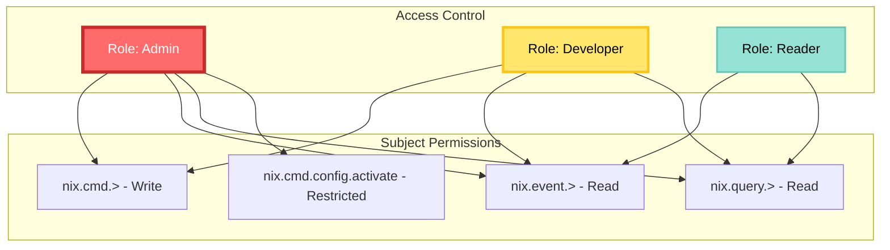

# NATS Subject Algebra for Nix Domain

## Subject Structure

The Nix domain uses a hierarchical subject structure following the algebra:

```
Subject = Domain × MessageType × Aggregate × Action
```

Where:
- `Domain` = { nix }
- `MessageType` = { cmd, event, query }
- `Aggregate` = { flake, package, module, overlay, config }
- `Action` = varies by message type and aggregate

## Subject Hierarchy Visualization



## Command Subject Tree

```mermaid
graph LR
    subgraph "Command Subjects"
        NIX_CMD[nix.cmd]
        
        subgraph "Flake Commands"
            FCM[nix.cmd.flake]
            FCM --> FC1[nix.cmd.flake.create]
            FCM --> FC2[nix.cmd.flake.update]
            FCM --> FC3[nix.cmd.flake.add_input]
            FCM --> FC4[nix.cmd.flake.remove_input]
        end
        
        subgraph "Package Commands"
            PCM[nix.cmd.package]
            PCM --> PC1[nix.cmd.package.build]
            PCM --> PC2[nix.cmd.package.cache]
        end
        
        subgraph "Module Commands"
            MCM[nix.cmd.module]
            MCM --> MC1[nix.cmd.module.create]
            MCM --> MC2[nix.cmd.module.update]
            MCM --> MC3[nix.cmd.module.delete]
        end
        
        subgraph "Overlay Commands"
            OCM[nix.cmd.overlay]
            OCM --> OC1[nix.cmd.overlay.create]
            OCM --> OC2[nix.cmd.overlay.update]
            OCM --> OC3[nix.cmd.overlay.delete]
        end
        
        subgraph "Config Commands"
            CCM[nix.cmd.config]
            CCM --> CC1[nix.cmd.config.create]
            CCM --> CC2[nix.cmd.config.update]
            CCM --> CC3[nix.cmd.config.activate]
            CCM --> CC4[nix.cmd.config.rollback]
        end
        
        NIX_CMD --> FCM
        NIX_CMD --> PCM
        NIX_CMD --> MCM
        NIX_CMD --> OCM
        NIX_CMD --> CCM
    end
    
    %% CIM Standard Styling
    style NIX_CMD fill:#FF6B6B,stroke:#C92A2A,stroke-width:4px,color:#FFF
    style FCM fill:#FF6B6B,stroke:#C92A2A,stroke-width:4px,color:#FFF
    style PCM fill:#FF6B6B,stroke:#C92A2A,stroke-width:4px,color:#FFF
    style MCM fill:#FF6B6B,stroke:#C92A2A,stroke-width:4px,color:#FFF
    style OCM fill:#FF6B6B,stroke:#C92A2A,stroke-width:4px,color:#FFF
    style CCM fill:#FF6B6B,stroke:#C92A2A,stroke-width:4px,color:#FFF
```



## Event Subject Tree

```mermaid
graph LR
    subgraph "Event Subjects"
        NIX_EVT[nix.event]
        
        subgraph "Flake Events"
            FEV[nix.event.flake]
            FEV --> FE1[nix.event.flake.created]
            FEV --> FE2[nix.event.flake.updated]
            FEV --> FE3[nix.event.flake.input_added]
            FEV --> FE4[nix.event.flake.input_removed]
        end
        
        subgraph "Package Events"
            PEV[nix.event.package]
            PEV --> PE1[nix.event.package.built]
            PEV --> PE2[nix.event.package.cached]
        end
        
        subgraph "Module Events"
            MEV[nix.event.module]
            MEV --> ME1[nix.event.module.created]
            MEV --> ME2[nix.event.module.updated]
            MEV --> ME3[nix.event.module.deleted]
        end
        
        subgraph "Overlay Events"
            OEV[nix.event.overlay]
            OEV --> OE1[nix.event.overlay.created]
            OEV --> OE2[nix.event.overlay.updated]
            OEV --> OE3[nix.event.overlay.deleted]
        end
        
        subgraph "Config Events"
            CEV[nix.event.config]
            CEV --> CE1[nix.event.config.created]
            CEV --> CE2[nix.event.config.updated]
            CEV --> CE3[nix.event.config.activated]
            CEV --> CE4[nix.event.config.rolled_back]
        end
        
        NIX_EVT --> FEV
        NIX_EVT --> PEV
        NIX_EVT --> MEV
        NIX_EVT --> OEV
        NIX_EVT --> CEV
    end
    
    %% CIM Standard Styling
    style NIX_EVT fill:#4ECDC4,stroke:#2B8A89,stroke-width:3px,color:#FFF
    style FEV fill:#4ECDC4,stroke:#2B8A89,stroke-width:3px,color:#FFF
    style PEV fill:#4ECDC4,stroke:#2B8A89,stroke-width:3px,color:#FFF
    style MEV fill:#4ECDC4,stroke:#2B8A89,stroke-width:3px,color:#FFF
    style OEV fill:#4ECDC4,stroke:#2B8A89,stroke-width:3px,color:#FFF
    style CEV fill:#4ECDC4,stroke:#2B8A89,stroke-width:3px,color:#FFF
```



## Query Subject Tree

```mermaid
graph LR
    subgraph "Query Subjects"
        NIX_QRY[nix.query]
        
        subgraph "Flake Queries"
            FQR[nix.query.flake]
            FQR --> FQ1[nix.query.flake.get]
            FQR --> FQ2[nix.query.flake.list]
            FQR --> FQ3[nix.query.flake.get_inputs]
        end
        
        subgraph "Package Queries"
            PQR[nix.query.package]
            PQR --> PQ1[nix.query.package.get]
            PQR --> PQ2[nix.query.package.list]
            PQR --> PQ3[nix.query.package.get_status]
        end
        
        subgraph "Module Queries"
            MQR[nix.query.module]
            MQR --> MQ1[nix.query.module.get]
            MQR --> MQ2[nix.query.module.list]
        end
        
        subgraph "Overlay Queries"
            OQR[nix.query.overlay]
            OQR --> OQ1[nix.query.overlay.get]
            OQR --> OQ2[nix.query.overlay.list]
        end
        
        subgraph "Config Queries"
            CQR[nix.query.config]
            CQR --> CQ1[nix.query.config.get]
            CQR --> CQ2[nix.query.config.list]
            CQR --> CQ3[nix.query.config.get_current]
            CQR --> CQ4[nix.query.config.get_history]
        end
        
        NIX_QRY --> FQR
        NIX_QRY --> PQR
        NIX_QRY --> MQR
        NIX_QRY --> OQR
        NIX_QRY --> CQR
    end
    
    %% CIM Standard Styling
    style NIX_QRY fill:#FFE66D,stroke:#FCC419,stroke-width:3px,color:#000
    style FQR fill:#FFE66D,stroke:#FCC419,stroke-width:3px,color:#000
    style PQR fill:#FFE66D,stroke:#FCC419,stroke-width:3px,color:#000
    style MQR fill:#FFE66D,stroke:#FCC419,stroke-width:3px,color:#000
    style OQR fill:#FFE66D,stroke:#FCC419,stroke-width:3px,color:#000
    style CQR fill:#FFE66D,stroke:#FCC419,stroke-width:3px,color:#000
```



## Command-Event Mapping



## Wildcard Subscription Patterns



## Subject Algebra Set Theory

```mermaid
graph TB
    subgraph "Set Definitions"
        D[Domain = {nix}]
        MT[MessageType = {cmd, event, query}]
        A[Aggregate = {flake, package, module, overlay, config}]
        CA[CommandAction = {create, update, delete, build, ...}]
        EA[EventAction = {created, updated, deleted, built, ...}]
        QA[QueryAction = {get, list, get_inputs, ...}]
    end
    
    subgraph "Cartesian Products"
        CS[CommandSubject = Domain × {cmd} × Aggregate × CommandAction]
        ES[EventSubject = Domain × {event} × Aggregate × EventAction]
        QS[QuerySubject = Domain × {query} × Aggregate × QueryAction]
    end
    
    subgraph "Union"
        S[Subject = CommandSubject ∪ EventSubject ∪ QuerySubject]
    end
    
    D --> CS
    MT --> CS
    A --> CS
    CA --> CS
    
    D --> ES
    MT --> ES
    A --> ES
    EA --> ES
    
    D --> QS
    MT --> QS
    A --> QS
    QA --> QS
    
    CS --> S
    ES --> S
    QS --> S
    
    %% CIM Standard Styling
    style D fill:#2D3436,stroke:#000,stroke-width:3px,color:#FFF
    style MT fill:#95E1D3,stroke:#63C7B8,stroke-width:2px,color:#000
    style A fill:#95E1D3,stroke:#63C7B8,stroke-width:2px,color:#000
    style CA fill:#FF6B6B,stroke:#C92A2A,stroke-width:4px,color:#FFF
    style EA fill:#4ECDC4,stroke:#2B8A89,stroke-width:3px,color:#FFF
    style QA fill:#FFE66D,stroke:#FCC419,stroke-width:3px,color:#000
    style CS fill:#FF6B6B,stroke:#C92A2A,stroke-width:4px,color:#FFF
    style ES fill:#4ECDC4,stroke:#2B8A89,stroke-width:3px,color:#FFF
    style QS fill:#FFE66D,stroke:#FCC419,stroke-width:3px,color:#000
    style S fill:#95E1D3,stroke:#63C7B8,stroke-width:2px,color:#000
```

## Subject Lifecycle Flow



## Subject Validation Rules



## Aggregate Subject Distribution



## Subject Naming Consistency

```mermaid
graph LR
    subgraph "Naming Pattern"
        CMD_PATTERN[Command: {action}]
        EVT_PATTERN[Event: {action_past_tense}]
        QRY_PATTERN[Query: get_{resource}]
    end
    
    subgraph "Examples"
        C1[create → created]
        C2[update → updated]
        C3[build → built]
        C4[activate → activated]
        Q1[get, list, get_*]
    end
    
    CMD_PATTERN --> C1
    CMD_PATTERN --> C2
    CMD_PATTERN --> C3
    CMD_PATTERN --> C4
    
    EVT_PATTERN --> C1
    EVT_PATTERN --> C2
    EVT_PATTERN --> C3
    EVT_PATTERN --> C4
    
    QRY_PATTERN --> Q1
    
    %% CIM Standard Styling
    style CMD_PATTERN fill:#FF6B6B,stroke:#C92A2A,stroke-width:4px,color:#FFF
    style EVT_PATTERN fill:#4ECDC4,stroke:#2B8A89,stroke-width:3px,color:#FFF
    style QRY_PATTERN fill:#FFE66D,stroke:#FCC419,stroke-width:3px,color:#000
```

## Subject Security Model



## Summary

The Nix domain subject algebra provides:

1. **Structured Hierarchy**: Clear 4-part naming convention
2. **Type Safety**: Compile-time validation of subjects
3. **Discoverability**: Predictable patterns for all operations
4. **Flexibility**: Wildcard subscriptions for various use cases
5. **Consistency**: Command→Event mapping follows naming rules
6. **Security**: Subject-based access control capabilities

Total subjects: 46 (16 commands + 16 events + 14 queries)