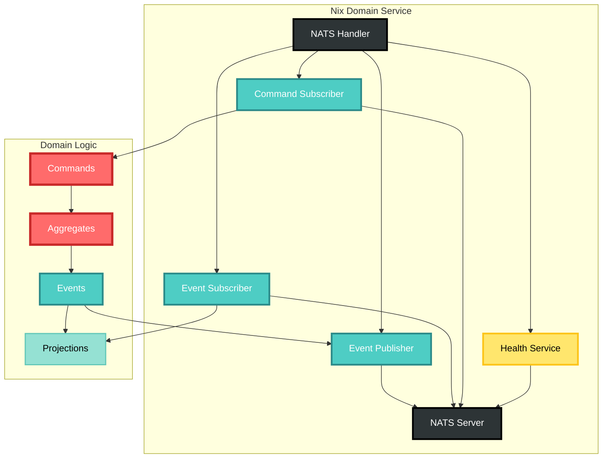

# NATS Integration Technical Plan

## Overview
This document provides the detailed technical plan for integrating NATS messaging into cim-domain-nix, enabling it to participate in the CIM distributed architecture.

## Dependencies

Add to Cargo.toml:
```toml
[dependencies]
async-nats = "0.33"
nats = "0.24"  # For sync operations if needed
futures = "0.3"
tokio-stream = "0.1"
bytes = "1.5"
```

## Architecture



## Implementation Steps

### 1. Core NATS Module Structure

```
src/nats/
├── mod.rs              # Public API
├── client.rs           # NATS client wrapper
├── publisher.rs        # Event publishing
├── subscriber.rs       # Event/command subscription
├── health.rs          # Health check responder
├── config.rs          # NATS configuration
└── error.rs           # NATS-specific errors
```

### 2. NATS Client Wrapper

```rust
// src/nats/client.rs
use async_nats::{Client, ConnectOptions};
use crate::Result;

pub struct NatsClient {
    client: Client,
    config: NatsConfig,
}

impl NatsClient {
    pub async fn connect(config: NatsConfig) -> Result<Self> {
        let options = ConnectOptions::new()
            .name("cim-domain-nix")
            .retry_on_initial_connect()
            .max_reconnects(10);
            
        let client = async_nats::connect_with_options(
            &config.url, 
            options
        ).await?;
        
        Ok(Self { client, config })
    }
    
    pub fn client(&self) -> &Client {
        &self.client
    }
}
```

### 3. Event Publisher

```rust
// src/nats/publisher.rs
use async_nats::{Client, HeaderMap};
use crate::events::NixDomainEvent;
use crate::value_objects::{CorrelationId, CausationId};

pub struct EventPublisher {
    client: Client,
    subject_prefix: String,
}

impl EventPublisher {
    pub async fn publish_event<E: NixDomainEvent>(
        &self,
        event: &E,
    ) -> Result<()> {
        let subject = format!(
            "{}.{}.{}", 
            self.subject_prefix,
            "event",
            event.event_type()
        );
        
        let mut headers = HeaderMap::new();
        headers.insert("X-Event-ID", event.event_id().to_string());
        headers.insert("X-Correlation-ID", event.correlation_id().to_string());
        headers.insert("X-Causation-ID", event.causation_id().to_string());
        headers.insert("X-Event-Type", event.event_type());
        headers.insert("X-Aggregate-ID", event.aggregate_id().to_string());
        headers.insert("X-Timestamp", event.occurred_at().to_rfc3339());
        
        let payload = serde_json::to_vec(&event)?;
        
        self.client
            .publish_with_headers(subject, headers, payload.into())
            .await?;
            
        Ok(())
    }
}
```

### 4. Command Subscriber

```rust
// src/nats/subscriber.rs
use crate::commands::NixCommand;
use crate::handlers::CommandHandler;

pub struct CommandSubscriber {
    client: Client,
    handler: Arc<CommandHandler>,
}

impl CommandSubscriber {
    pub async fn start(&self) -> Result<()> {
        let subjects = vec![
            "nix.cmd.flake.create",
            "nix.cmd.flake.update",
            "nix.cmd.package.build",
            // ... other command subjects
        ];
        
        for subject in subjects {
            let mut subscriber = self.client.subscribe(subject).await?;
            let handler = self.handler.clone();
            
            tokio::spawn(async move {
                while let Some(msg) = subscriber.next().await {
                    if let Err(e) = Self::handle_command(handler.clone(), msg).await {
                        tracing::error!("Command handling error: {}", e);
                    }
                }
            });
        }
        
        Ok(())
    }
    
    async fn handle_command(
        handler: Arc<CommandHandler>,
        msg: Message,
    ) -> Result<()> {
        // Extract correlation/causation from headers
        let correlation_id = msg.headers
            .and_then(|h| h.get("X-Correlation-ID"))
            .and_then(|v| v.as_str())
            .unwrap_or_default();
            
        // Deserialize command
        let command: Box<dyn NixCommand> = /* deserialize based on subject */;
        
        // Handle command
        let events = handler.handle_command(command).await?;
        
        // Publish resulting events
        for event in events {
            // Publish with correlation chain
        }
        
        // Send reply if requested
        if let Some(reply) = msg.reply {
            msg.respond(/* success response */).await?;
        }
        
        Ok(())
    }
}
```

### 5. Health Check Service

```rust
// src/nats/health.rs
pub struct HealthService {
    client: Client,
}

impl HealthService {
    pub async fn start(&self) -> Result<()> {
        let mut subscriber = self.client
            .subscribe("health.cim-domain-nix")
            .await?;
            
        tokio::spawn(async move {
            while let Some(msg) = subscriber.next().await {
                let health = json!({
                    "status": "healthy",
                    "service": "cim-domain-nix",
                    "version": env!("CARGO_PKG_VERSION"),
                    "timestamp": Utc::now().to_rfc3339(),
                });
                
                let _ = msg.respond(serde_json::to_vec(&health)?).await;
            }
        });
        
        Ok(())
    }
}
```

### 6. Subject Naming Convention

```
# Commands
nix.cmd.flake.create
nix.cmd.flake.update
nix.cmd.flake.add_input
nix.cmd.package.build
nix.cmd.module.create
nix.cmd.overlay.create
nix.cmd.config.create
nix.cmd.config.activate

# Events  
nix.event.flake.created
nix.event.flake.updated
nix.event.flake.input_added
nix.event.package.built
nix.event.module.created
nix.event.overlay.created
nix.event.config.created
nix.event.config.activated

# Queries
nix.query.flake.get
nix.query.flake.list
nix.query.package.status
nix.query.config.current

# Health
health.cim-domain-nix
```

### 7. Configuration

```rust
// src/nats/config.rs
#[derive(Debug, Clone, Deserialize)]
pub struct NatsConfig {
    pub url: String,
    pub subject_prefix: String,
    pub auth: Option<NatsAuth>,
    pub tls: Option<NatsTls>,
}

#[derive(Debug, Clone, Deserialize)]
pub struct NatsAuth {
    pub username: Option<String>,
    pub password: Option<String>,
    pub token: Option<String>,
    pub nkey: Option<String>,
}

impl Default for NatsConfig {
    fn default() -> Self {
        Self {
            url: "nats://localhost:4222".to_string(),
            subject_prefix: "nix".to_string(),
            auth: None,
            tls: None,
        }
    }
}
```

### 8. Integration with Existing Code

Update aggregate to use event publisher:

```rust
// src/aggregate/mod.rs
impl FlakeAggregate {
    pub async fn handle_command_with_nats(
        &mut self,
        cmd: Box<dyn Any>,
        publisher: &EventPublisher,
    ) -> Result<()> {
        let events = self.handle_command(cmd)?;
        
        for event in events {
            if let Some(nix_event) = event.downcast_ref::<dyn NixDomainEvent>() {
                publisher.publish_event(nix_event).await?;
            }
        }
        
        Ok(())
    }
}
```

### 9. Testing Strategy

1. **Unit Tests**: Mock NATS client
2. **Integration Tests**: Use NATS test container
3. **End-to-End Tests**: Full message flow
4. **Performance Tests**: Throughput and latency

### 10. Error Handling

- Connection failures: Exponential backoff
- Publishing failures: Retry with dead letter
- Subscription failures: Log and reconnect
- Deserialization failures: Send to error topic

## Timeline

- Day 1-2: Core NATS module structure
- Day 3-4: Event publisher implementation
- Day 5-6: Command subscriber implementation
- Day 7-8: Health service and configuration
- Day 9-10: Integration with existing code
- Day 11-12: Testing and documentation
- Day 13-14: Performance optimization

## Success Criteria

- [ ] All events published to NATS
- [ ] All commands received via NATS
- [ ] Health checks responding
- [ ] 95%+ message delivery rate
- [ ] <10ms average latency
- [ ] Graceful reconnection handling
- [ ] Comprehensive error logging